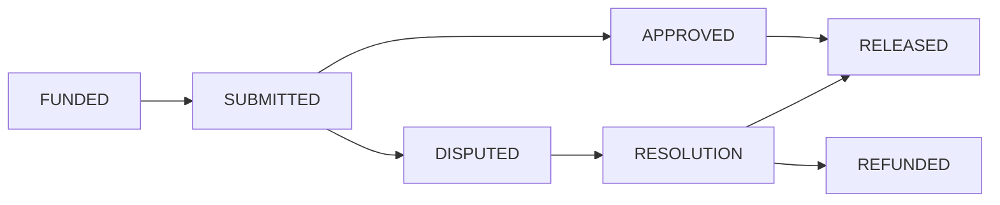

# ⬡ AVAXVERSE

**One Identity. Sovereign Work.**

**A decentralized super app and trust protocol for identity, freelance work, and community governance on Avalanche.**

AVAXVERSE is not just a marketplace; it is a **unified execution layer** for digital work. We are evolving from a hub of modules into a **Professional Super App**—a trust network where every professional action compounds into a sovereign on-chain legacy.

### 🏗️ Conceptual Flow
The entire ecosystem anchors around a single source of truth:
**Identity** ➔ **Reputation** ➔ **Jobs** ➔ **Portfolio** ➔ **Governance**

---

## 💎 The Four Pillars of the Trust Network

To transition from a "Job Marketplace" to a "Trust Network," AVAXVERSE implements four critical professional primitives:

### 1. Portable Reputation Score (Global Trust)
Reputation is no longer trapped in a silo. Your `reputationScore` from the `IdentityRegistry` is visible across every module—job cards, applications, and profiles. It directly influences your **Governance Weight**, meaning those who contribute most have the loudest voice.

### 2. Skill-Based Intelligence (Smarter Matching)
Jobs are no longer just text. Enhanced metadata includes **Skill Tags** (e.g., Solidity, UI Design, Rust). This enables predictive job matching based on your DID’s historical performance and skill profile.

### 3. Proof-of-Work Portfolio (Visual Resume)
Every completed mission is a permanent entry in your professional history. We visualize these as a **Web3 Resume**, pulling directly from your successful Escrow settlements. This provides undeniable proof of competence for future clients.

### 4. Decentralized Professional Court (Juror System)
Arbitration is handled by a decentralized court of peers. When a high-stakes job enters a `DISPUTED` state, the community acts as a jury. Using **Reputation-Weighted Voting**, jurors review evidence and determine the final escrow settlement (Release, Refund, or Split). This turns AVAXVERSE into a fully autonomous, trustless arbitration system.

---

## 🏗️ Technical Architecture

AVAXVERSE is built on a modular "Hub & Spoke" architecture. At the center lies the **Core Trust Layer**, which provides the foundation for all other modules.

### 1. Core Trust Layer
*   **IdentityRegistry (DID)**: Implements decentralized identifiers (`did:avax:[address]`). Each wallet owns a single, permanent identity with attached sovereign metadata (bio, socials, skills).
*   **ReputationToken (SBT)**: A Soulbound ERC-721 (strictly non-transferable) that acts as an on-chain resume. Every completed mission mints a unique achievement token.
*   **Escrow Protocol**: A sophisticated state machine that handles multi-stage mission funding, delivery, review, and settlement.

### 2. Escrow State Machine
The protocol enforces a deterministic lifecycle for every financial coordination:

---

## 🚀 The 7 Modules of the Super App

AVAXVERSE is designed to be the "Super App for On-Chain Work", connecting multiple professional functions into a single interface.

| Module | Status | Description |
|---|---|---|
| **M1: Jobs** | ✅ Live | The core marketplace layer for high-stakes missions and long-term freelance contracts. |
| **M2: Bounties** | ⚒️ Next | Simplified task layer for rapid bug bounties, design contests, and community micro-tasks. |
| **M3: Governance** | ✅ Beta | **Decentralized Professional Court.** The jurisdiction layer where DID holders act as jurors to resolve mission disputes. |
| **M4: Portfolio** | 📅 Planned | Visualized Web3 resume pulling from your Reputation SBTs and ProofOfWork history. |
| **M5: DeFi Layer** | 📅 Future | Reputation-boosted staking, yield-bearing escrows, and professional credit scoring. |
| **M6: Collaboration** | 📅 Future | Integrated secure messaging, milestone tracking, and decentralized file storage. |
| **M7: AI Assistant** | 🧪 Concept | Predictive job matching, AI-assisted proposal writing, and automated work verification. |

---

## ⚙️ Stack & Infrastructure

| Layer | Technology |
|---|---|
| **Blockchain** | Avalanche C-Chain / Custom Subnets |
| **Contracts** | Solidity 0.8.26 + Hardhat + OpenZeppelin v5 |
| **Frontend** | Next.js 15 (App Router) + Tailwind CSS 4 |
| **Web3** | Wagmi v3 + Viem v2 + RainbowKit v2 |
| **Storage** | IPFS / Arweave (Metadata) |
| **Oracle** | Chainlink (Planned for Price Feeds) |

---

## 📅 Roadmap: The Expansion Journey

### Phase 1: Foundation (Current)
- [x] On-chain Identity (DIDs)
- [x] Soulbound Reputation Engine
- [x] Multi-stage Escrow Contracts
- [x] Governance Demo (Professional Court Flow)

### Phase 2: Growth (Q2 2026)
- [ ] Bounties & Contests Module
- [ ] IPFS/Arweave integration for large metadata
- [ ] Fuji Testnet Public Beta
- [ ] Mobile PWA Optimization

### Phase 3: Ecosystem (2027+)
- [ ] Cross-chain Reputation Bridges
- [ ] DeFi-integrated Work Finance
- [ ] AI-Orchestrated Marketplace Management

---

## 🤝 Contributing & Community

We welcome contributors who believe in the future of sovereign on-chain work.

- **Twitter/X**: [@AVAXVERSE](https://x.com/AVAXVERSE)
- **Discord**: [Join the Community](https://discord.gg/avaxverse)
- **Documentation**: [docs.avaxverse.xyz](https://docs.avaxverse.xyz)

---

**AVAXVERSE — Building the Sovereign Economy on Avalanche.**
